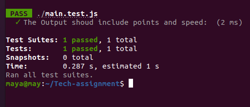
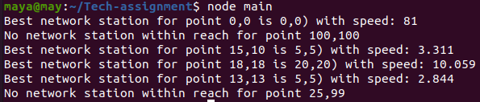

 **NETWORK SPEED CALCULATION**

The problem solved by JavaScript program 
 In this program I tried to address three two points (x,y,z) as lon, lat and redius , The code structure contains 5 JS files

 1. **calculate_distance.js:** 
   
   Here used to calculate the distance of the device from the network station. The method I used to calculate is linear distance equestions.
   
   Linear Distance means the shortest horizontal distance from the nearest point of a structure or object to the high speed or network line to the device from station.

**Distance calculation code description:**

                var calculateDistance = function (point1, point2) {
                    /*Take the coordinates of two points we want to find the distance between.*/
                    var x21 = point2.x - point1.x;
                    /* x1 is the horizontal coordinate (along the x axis) of Point 1, and 
                       x2 is the horizontal coordinate of Point 2. */
                    var y21 = point2.y - point1.y;
                    /*y1 is the vertical coordinate (along the y axis) of Point 1, 
                    y2 is the vertical coordinate of Point 2.
                    For an example, take the points (0,0) and (100,100). If (0,0) is (x1,y1), then (100,100) is (x2,y2).
                    x21= 100-0 and y21 = 100-0  ==> (Xb,Yb) =(100.100) which is called base points between horizontal and vertical linear distances
                    */
                    var Xpoint = Math.pow(x21, 2);  //((x2-x1),2)==>(100,2) 2 the power of 100
                    var Ypoint = Math.pow(y21, 2);  //((y2-y1),2)==>(100,2) 2 the power of 100
                    //Find the linear horizontal and vertical distance between the the two points
                    var DistanceOfTwoPoints = Math.sqrt(Xpoint + Ypoint); // final distance between two points
                    return DistanceOfTwoPoints;
                };
                exports.calculateDistance = calculateDistance;

 2. **calculate_speed.js:**
   
The formula for speed calculation is previously defined in the assignment problems:
What is the network speed from the current device location to the location of the indicated station?
The formula is defined as follows. 
           

            speed = (reach - device's distance from network station)^2

This file contains the code for calculating the speed of a network connection between a network station and a node or devices.
To do so, I utilized the math.pow() function from the built-in math library.

We can also utilize it without the built-in function, as seen below. 
            
            var result = (reach-distance)*(reach-distance);
            return res;

 3. **define_device_loc.js:**
I defined and initialized the value of xy points for the device's current location in this file. 

 4. **define_station.js:** I defined and initialized the value of the current point of the station position in this file. 
 5. **main.js:** Because all code segments are written separately, any programmer can easily edit the main.js program. In this js file, the output is generated. Any coders may easily maintain and modify this. 

 **INSTRUCTION**

If you want to test  a piece of code worked or not, you can use VSCode to run JavaScript.

This instruction explains how to run JavaScript problem solution in VSCode. To run this JavaScript code in Visual Studio, follow these steps:

1. The first step is to install Node.js on your MacBook/Windows/Ubuntu computer so that you may use it to call scripts.
        You can get Node.js for free by going to this link. https://nodejs.org/en/ => please install latest Node js
2. The second step is to create a new folder and then open it in Visual Studio Code.
After that, in visual studio code go to teminal and then select new terminal. In the terminal write the following command:

From Github

        $git clone https://github.com/maya-tsedeke/Tech-assignment.git 
        $cd Tech-assignment/NordCloud
        $node main.js

OR From Amazone web Services (AWS) cloud 

        $git clone https://git-codecommit.us-east-1.amazonaws.com/v1/repos/JavaScript_Project
        $cd JavaScript_Project/NordCloud
        $node main.js

————
You will get the following result on the terminal after running the above commands.
———— 

You can start by editing the define device loc and define station.js files.
Create and store JavaScript code.
You may then run node main.js again to test your changes.

**NB:** You may also test your outcome using the browser console. 

**TESTING INSTRUCTION**
Jest testing tools were used in this solution.
To install or add it to your project, run the following commands in the Ubuntu terminal or Visual Studio Code.It is widely used for JavaScript unit testing. 

        $npm install --save-dev jest
Note that the yarn commands are used in the Jest documentation, but npm will also work.

Let's begin by writing a test for a find best station function that computes both distance and speed.
To begin, add or create the following section to your package.json: 

            {
            "scripts": {
                "test": "jest"
            }
            }
Finally, type the following into the terminal, and Jest will print the following message:

            $run yarn test 
            or 
            $npm run test 
I used the Linux operating system in my Jest to print this message. You can use the code in any operating system or Visual Studio (IDE) 

The expected output should look like this:

If you have any suggestions or changes, please let me know. 
